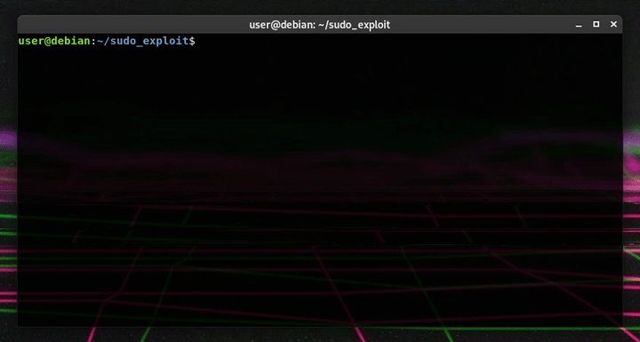

# ⚔️ Performing the Attack

The main idea of the exploit we present is to use the mechanism for dynamic loading of libraries during program execution in such a way we are able to load a malicious library designed by us instead of the legitimate library. In order to do so, we need to properly corrupt the portion of the heap that corresponds to the name field of the `service_user` structure that is used by the Named Service Switch (NSS) to load the shared object of the needed library. The memory corruption is clearly performed through the buffer overflow vulnerability we have presented, and in particular we make use of the local environment variables declared at execution time of sudoedit.

The idea of the exploit has been discolsed by the Qualys research team in their [report](https://packetstormsecurity.com/files/161160/Sudo-Heap-Based-Buffer-Overflow.html) on the vulnerability, while the expoit itself has been taken from [D3v17 repository](https://github.com/0xdevil/CVE-2021-3156).

For this exploit, a the version of sudo used is `Version 1.8.27 (1.8.27-1+deb10u1)`.

